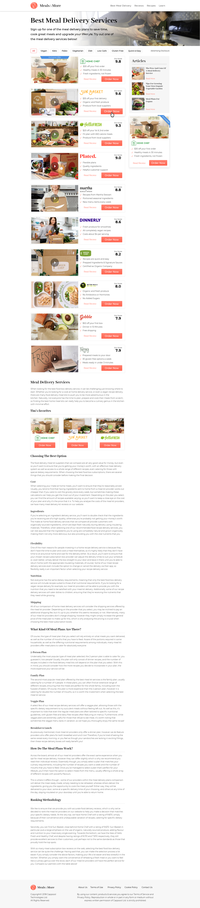

# zeplin-to-css
An example of making a responsive design according to strict styles in zeplin. 
Using flexbox for responsive layouts and responsive components.

 

 
-------------------------------------------------------------------------------------------------
 

